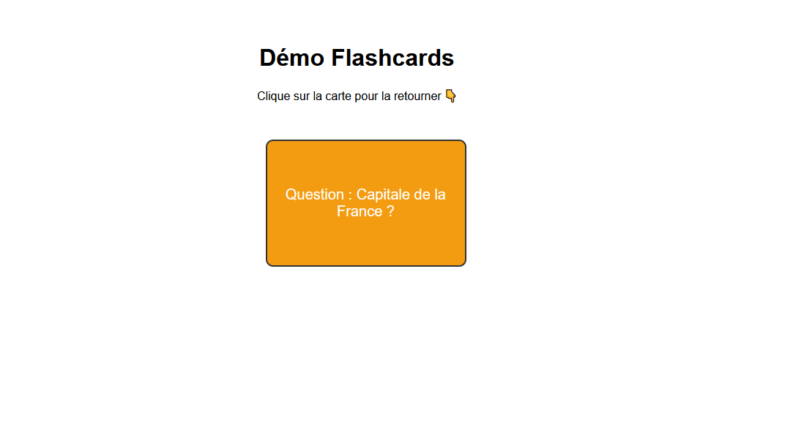

# 🃏 Démo Flashcards

Une petite démo en **HTML / CSS / JavaScript** pour montrer un principe simple de **flashcard interactive** :  
👉 [Voir la démo en ligne](https://rachid-hammami.github.io/flashcards-demo/)

---

## 🎯 Objectif
- Illustrer l’utilisation de **JavaScript** pour créer une interaction dynamique.  
- Démontrer mes bases en **HTML5 / CSS3** (structure et mise en page responsive).  
- Fournir un projet clair, simple et facile à lire pour un recruteur.

---

## 📂 Contenu du projet
- `index.html` → structure de la page  
- `style.css` → mise en page et effets visuels  
- `script.js` → logique JavaScript pour retourner la carte  

---

## 🚀 Démo
Carte recto : **Question : Capital de la France ?**  
Carte verso : **Réponse : Paris**  

👉 Clique sur la carte pour la retourner !

---

## 🛠️ Technologies utilisées
- **HTML5** : structure de la page  
- **CSS3** : design, transitions, effet flip 3D  
- **JavaScript** : gestion des événements (clic → retournement)  

---

## 📸 Aperçu

*(Astuce : ajoute une capture d’écran de ta démo → nomme-la `screenshot.png` et place-la à la racine du repo pour que ça s’affiche ici)*

---

## 📬 Contact
- 📧 [anzaikun@gmail.com](mailto:anzaikun@gmail.com)  
- 🔗 [Portfolio principal](https://rachid-hammami.github.io/portfolio)  
- 🔗 [GitHub](https://github.com/rachid-hammami)
